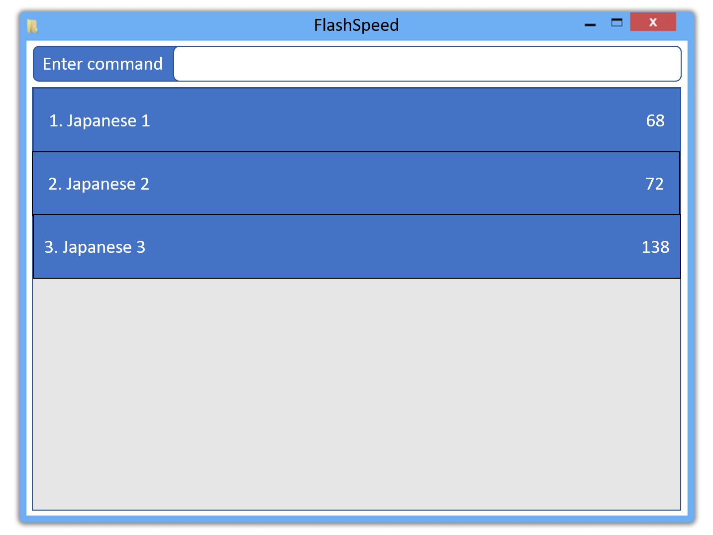

= FlashSpeed
ifdef::env-github,env-browser[:relfileprefix: docs/]

https://travis-ci.org/AY1920S2-CS2103T-W17-1/main[image:https://travis-ci.org/AY1920S2-CS2103T-W17-1/main.svg?branch=master[Build Status]]
//https://ci.appveyor.com/project/damithc/addressbook-level3[image:https://ci.appveyor.com/api/projects/status/3boko2x2vr5cc3w2?svg=true[Build status]]
//https://coveralls.io/github/se-edu/addressbook-level3?branch=master[image:https://coveralls.io/repos/github/se-edu/addressbook-level3/badge.svg?branch=master[Coverage Status]]

ifdef::env-github[]

endif::[]

ifndef::env-github[]
image::images/Ui.png[width="600"]
endif::[]
&nbsp;

ifdef::env-github[]
image::docs/images/Ui2.png[width="600"]
endif::[]

ifndef::env-github[]
image::images/Ui2.png[width="600"]
endif::[]

== What is it?

FlashSpeed is a text-based flashcard application specifically designed for university students who are learning a foreign language. University students often have hectic schedules. With this in mind, FlashSpeed was created to allow students to be able to study and revise foreign vocabulary on the fly. With a single command, you can start a quick study session on FlashSpeed whenever!

Keeping, flipping, and tracking physical flashcards can be a pain. FlashSpeed enhances the studying process by having virtual flashcards and a smarter review system. Users will be tested more frequently on flashcards that they had trouble memorizing previously.

By using FlashSpeed, you will learn faster and remember for longer!

== Who is it for?

FlashSpeed is intended for university students reading a foreign language module who need an effective way to memorize a lot of new vocabulary fast and for the long term. It can also be used by students who need to remember a lot of information (e.g. historical dates, definitions, etc.) before an exam.

Of course, anyone who needs a powerful memorization tool can benefit from using FlashSpeed!

== Site Map

* https://ay1920s2-cs2103t-w17-1.github.io/main/UserGuide.html[User Guide]
* https://ay1920s2-cs2103t-w17-1.github.io/main/DeveloperGuide.html[Developer Guide]
* https://ay1920s2-cs2103t-w17-1.github.io/main/AboutUs.html[About Us]
* https://ay1920s2-cs2103t-w17-1.github.io/main/ContactUs.html[Contact Us]

//* <<UserGuide#, User Guide>>
//* <<DeveloperGuide#, Developer Guide>>
//* <<LearningOutcomes#, Learning Outcomes>>
//* <<AboutUs#, About Us>>
//* <<ContactUs#, Contact Us>>

== Acknowledgements

* FlashSpeed is built on top of the AddressBook-Level3 project created by SE-EDU initiative at https://se-education.org.
* Some parts of the sample application were inspired by the excellent http://code.makery.ch/library/javafx-8-tutorial/[Java FX tutorial] by
_Marco Jakob_.
* Libraries used: https://openjfx.io/[JavaFX], https://github.com/FasterXML/jackson[Jackson], https://github.com/junit-team/junit5[JUnit5]

== Licence : link:LICENSE[MIT]
